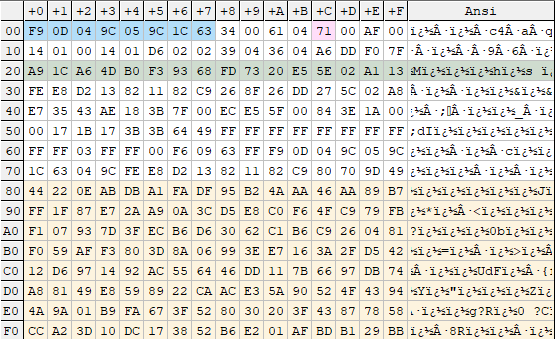
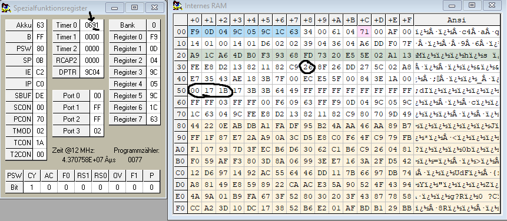

# Gruppe 4: Task Scheduler und Monitoring in 8051 Assembly

*von Ben Bekir Ertugrul, Frederik Höft, Patrik Schottelius und Manuele Waldheim*

---

# Anmerkungen

Bei der Umsetzung wurde mit Makros gearbeitet (`threading.a51`), die anschließend über einen in C# selbst geschriebenen pre-assembler (cross-platform executables verfügbar in den [GitHub cross-platform releases (link)](https://github.com/benbekir/8051-assembly/releases)) aufgelöst werden. Die generierte `threading-generated.a51` datei kann anschließend wie gewohnt über `AS51 V4.exe` assembled werden.

Die im 8051 Code verwendeten Makros werden dabei 1:1 durch die in der Datei oben definierten Werte ersetzt. Dies dient hauptsächlich der verbesserten Lesbarkeit des 8051 Assembly Codes.

# Scheduler

## Konzept

Auf Grund der Echtzeit-Anforderung des Reaktionstask, muss dieser mindestens einmal alle 10 ms laufen. In unserer Implementierung wird nach der Initialisierung der Sortier-Task gestartet und der Timer Interrupt freigegeben. Diese Timer Interrupts werden anschließend jedoch nur alle 10 ms verarbeitet, sodass die Vorgabe für den Reaktionstask gerade so eingehalten wird. Ausgehend von einer Abschätzung (10 ms intervall @12MHz CPU Taktfrequenz $\implies$ 1MHz Zyklusfrequenz $\implies$ 10.000 Zyklen pro 10ms Intervall, bei $\varnothing\sim 2$ Zyklen pro Instruction liefert ca. 5.000 Instructions pro interrupt) kamen wir zu dem Schluss, dass wir somit nacheinander und konfliktfrei während einer solchen Interruptverarbeitung alle drei anderen Tasks einmal "komplett durchlaufen lassen" können. Somit werden nacheinander der Reaktions, Clock (und alle 10 sekunden Temperatur)-task verarbeitet. Anschließend wird das Sortieren fortgesetzt.

Aufgrund dieser Erkenntnis haben wir ein Single-Stack-Single-Register bank Design gewählt:

**Single Stack**
Hierbei werden die untersten Stack Frames immer vom Sortierungs Task verwendet (oder der `end` instruction, bzw. stack empty) und dann beim Auftreten eines Interrupts darauf aufbauend die anderen Tasks gepushed. Da diese Tasks nacheinander bis zum `return` durchlaufen, entstehen an dieser Stelle keine Konflikte. Anschließend wird das letzte Stack Frame mit dem "return from interrupt" gepoppt und der Sortier-Task läuft weiter.

**Single Register bank**
Weiterhin verwenden wir nur eine einzelne Register Bank, die wir beim Start der Interruptverarbeitung in den von uns definierten `SWAP` Bereich im internen RAM sichern, und vor dem "return from interrupt" wieder herstellen. Gesichert werden hierbei: `PSW, A, B, r0-7, DPTR (dpl, dph)`, sowie die beiden selbst-definierten 32 bit "Register" `UINT32_0` und `UINT32_1`, bei denen es sich um spezielle RAM Regionen für 32 bit bit-shifting- und Additions-Operationen handelt (benötigt für das Dividieren der 16 bit Summe durch die Konstante `10` bei der Berechnung des Temperaturdurchschnitts). Diese Division wird ersetzt durch eine Multiplikation (weiterhin ersetzt durch `shift` und `add`) mit `0xcccd` (16 bit, mit overflow in 32 bit), gefolgt von einem Bitshift um 19 bits nach rechts. Theoretisch greifen wir nur an dieser Stelle auf die 32 bit Register zu, halten uns jedoch durch das Sichern in den `SWAP`-Space die Möglichkeit offen, dies auch an anderen Stellen zu tun.

Weiterhin erlaubt uns das Single-Register-Bank design die Verwendung von pre-assembler Makros für direkten Zugriff auf die Register über den internen RAM, z.b. über

```c
#define DIRECT_R0		00h
; ...
push DIRECT_R0	; expands to push 00h
```

was eine deutlich verbesserte Lesbarkeit des Codes mit sich führt.

## Überblick

### RAM layout

| Region        | Start | End   | Size | Description                                 |
| --------------|-------|-------|------|---------------------------------------------|
RESERVED      	| 0x0	| 0x8	| 8    | register bank 0
STACK         	| 0x8	| 0x2f	| 24   | stack
RAM S	  	 	| 0x30	| 0x4f	| 32   | RAM for Scheduler / monitoring / 32 bit general purpose register
RAM 1    	 	| -	 	| -	 	| 0    | RAM for Task 1: Reaction (allocation free)
RAM 2	  	 	| 0x50	| 0x57	| 8    | RAM for Task 2: Clock
RAM 3	  	 	| 0x58	| 0x67	| 16   | RAM for Task 3: Temperature
RAM 0  	 	 	| -	 	| -     | 0    | RAM for Task 0: Sorting (allocation free)
SWAP 		 	| 0x68	| 0x7f	| 24   | swap area for execution context

### Globale Makros

| Makro | Wert | Bedeutung |
| --- | --- | --- |
| `TRUE` | #ffh | Booleanwert `true` mit `TRUE XOR FALSE = TRUE` |
| `FALSE` | #00h | Booleanwert `false` mit `TRUE XOR FALSE = TRUE` |
| `DIRECT_R[0-7]` | 00h - 07h | IRAM addresse der register r0-r7 für direkten Zugriff. |
| `STACK_START` | #07h | Stack startet bei addresse 0x8 (-1 wegen stack pointer) |
| `UINT32_0[0-3]` | 30h-33h | Universelles unsigned 32 bit little endian Register 0 für 32 bit Addition / bit shifting, direkte addresse |
| `UINT32_1[0-3]` | 34h-37h | Universelles unsigned 32 bit little endian Register 1 für 32 bit Addition / bit shifting, direkte addresse |
| `UINT32_0_PTR` | #30h | `uint32_t*` auf UINT32_0 register |
| `UINT32_1_PTR` | #34h | `uint32_t*` auf UINT32_1 register |

## Scheduler

Der Scheduler läuft alle 10 ms und ruft die Funktion `TasksNofityAll()` auf. Dabei wird zuerst der aktuelle `ExecutionContext` durch Aufrufen der `EXC_STORE` Funktion in den `SWAP` Bereich geschrieben.
Anschließend wird der `Reaktions` task aufgerufen. Nachdem der `Reaktions` task beendet wurde, wird weiterhin die `Clock` benachrichtigt, dass 10 ms vergangen sind. Abhängig von dem internen Clock-counter wird dann eine Sekunde inkrementiert, wobei dann weiterhin der `Temperatur` task benachrichtigt wird.

Nachdem alle Tasks benachrichtigt wurden wird der originale `ExecutionContext` wieder aus dem `SWAP` Bereich geladen (`EXC_RESTORE`) und der Interrupt beeendet. Somit läuft der `Sort` task nach kurzer Unterbrechung des Schedulers weiter.

```text
INIT->SORT                                                     --> SORT
           \                                                  /
   Interrupt-->EXC_STORE->Reaction->Clock->EXC_RESTORE->reti -
```

### Makros

#### Speicherbelegung

| Makro |Speicheradresse|Information|
| --- | --- | --- |
| `INTERRUPT_COUNT` | 38h | Addresse des Interrupt-Zählers, erlaubt Aufruf von `TasksNofityAll()` alle 10ms. |
| `SWAP_A` | 68h | Swap space für Register `a` bei Interruptbehandlung (`TasksNofityAll()`) |
| `SWAP_B` | 69h | Swap space für Register `b` bei Interruptbehandlung (`TasksNofityAll()`) |
| `SWAP_R[0-7]` | 6Ah-71h | Swap space für Register `r0-r7` |
| `SWAP_DP[L|H]` | 72h-73h | Swap space für `dptr (dpl, dph)` |
| `SWAP_UINT32_0[0-3]` | 74h-77h | Swap space für `UINT32_0` 32 bit register |
| `SWAP_UINT32_1[0-3]` | 78h-7Bh | Swap space für `UINT32_1` 32 bit register |
| `SWAP_PSW` | 7Ch | Swap space für program status word (`psw`) |

#### Konstanten

| Makro | Wert | Bedeutung |
| --- | --- | --- |
| `INTERRUPT_COUNT_RESET_VALUE` | #40d | Reset-Wert für `INTERRUPT_COUNT` $\left(40 \cdot \frac{1}{4000} \frac{1}{\text{s}} = 10\text{ms}\right)$, danach wird `TasksNofityAll()` aufgerufen. |

##  Task 0: Berechnungs-Task (C-Task)

Der Berechnungs-Task sortiert den gesamten externen RAM aufsteigend nach Größe.
Benutzt wird der Bubble-Sort Algorithmus (Einfachheit + inplace $\gg$ Optimale Zeitkomplexität):

```c
// our 8051 bubble sort implementation as it would look like in C.
// this snippet serves as a reference for the logic implemented by 
// our Sort_Notify function.
static uint8_t* xram = 0x0000;
static uint16_t length = 0xffff;

void bubble_sort()
{
    uint8_t swapped = true;
    while (swapped != false)
    {
        swapped = false;
        uint16_t i = 1;
        uint16_t j = i - 1;
        uint8_t previous = xram[j];
        while (j != length)
        {
            uint8_t current = xram[i];
            if (current - previous < 0)
            {
                xram[i] = previous;
                xram[j] = current;
                swapped = true;
            }
            else
            {
                previous = current;
            }
            j = i;
            i++;
        }
    }
}
```

### Makros

#### Speicherbelegung

Der Sortier-task greift nicht auf den internen Speicher (IRAM) zu (ausgenommen `dpl`, `dph`), sondern arbeitet ausschließlich in Registern.

#### Register Variablen

| Makro | Register | Bedeutung |
| --- | --- | --- |
| `SORT_SWAPPED` | `b` | gibt an, ob der aktuelle BubbleSort durchlauf bereits Elemente vertauscht hat (Abbruchbedingung) |
| `SORT_PREVIOUS` | `r0` | enthält das Element der vorherigen speicherzelle bei index `j` bzw `i - 1` |
| `SORT_CURRENT` | `r1` | enthält das Element der aktuellen speicherzelle bei index `i` |
| `SORT_J_LOW` | `r2` | index des vorherigen Elements (low byte) |
| `SORT_J_HIGH` | `r3` | index des vorherigen Elements (high byte) |
| `SORT_I_LOW` | `r4` | index des aktuellen Elements (low byte) |
| `SORT_I_HIGH` | `r5` | index des aktuellen Elements (high byte) |
| `SORT_CURRENT_DIRECT` | `DIRECT_R1` | direkter zugriff auf register r1 (addresse `01h`) |
| `SORT_I_LOW_DIRECT` | `DIRECT_R4` | direkter zugriff auf register r4 (addresse `04h`) |
| `SORT_I_HIGH_DIRECT` | `DIRECT_R5` | direkter zugriff auf register r5 (addresse `05h`) |

### Tests

Um die Funktion nachzuweisen, wurde ein Array mit 256 Werten sortiert.


## Task 1: Reaction-Task (R-Task)

Der Reaction-Task liest alle 10 ms den Wert aus Port 1 aus und schreibt basierend auf der Größenordnung einen festgelegten Wert in Port 3.

|Speicheradresse|Information|
| --- | --- |
|Port 1|Der auszulesende Wert|
|Port 3|Der berechnete Wert|

Der Wert in Port 3 wird in den zwei least significant bits folgendermaßen gespeichert:

|Wertebereiche (Port 1)|Resultat (Port 3 / XH, XL)|
| --- | --- |
| $100 < x <200$ |0, 0|
| $x \geq 200$ |1, 0|
| $x<100$ |0, 1|
| $x=100\ \lor$ error|1, 1|

### Makros

#### Speicherbelegung

Der Reaktionstask greift nicht auf den Speicher zu (ausgenommen port 1, port 3), sondern arbeitet ausschließlich in Registern.

#### Register Variablen

| Makro | Register / Port | Bedeutung |
| --- | --- | --- |
| `REACTION_INPUT`  | `p1` | Eingangsport |
| `REACTION_OUTPUT` | `p3` | Ausgabeport |
| `REACTION_TEST_VALUE` | `r0` | Eingelesener Wert / Konstanter snapshot von `p1` |
| `REACTION_RETURN_VALUE` | `r1` | Rückgabewert, wird vor return in Ausgabeport geschrieben. |

#### Konstanten

| Makro | Wert | Bedeutung |
| --- | --- | --- |
| `REACTION_CODE_LESS_100` | 1 | gibt an, dass `p1` $< 100$ |
| `REACTION_CODE_100` | 3 | gibt an, dass `p1` $= 100$ |
| `REACTION_CODE_100_200` | 0 | gibt an, dass $100 <$ `p1` $< 200$ |
| `REACTION_CODE_200_PLUS` | 2 | gibt an, dass `p1` $\geq 200$ |

### Tests

Die Funktion des Reaktions-Tasks wird im Folgenden durch Tests veranschaulicht und verifiziert:

| Wert Port 1 | Wert Port 3 |
|------|---|
| 0    | 0x1	   |
| 99    | 0x1 |
| 100    | 0x3 |
| 101    | 0x0 |
| 150    | 0x0 |
| 199    | 0x0 |
| 200    | 0x2 |
| 255    | 0x2 |

## Task 2: Clock

### Makros

#### Speicherbelegung

| Makro |Speicheradresse|Information|
| --- | --- | --- |
| `*CLOCK_HOURS_PTR` | 50h | Speicheraddresse der Stunden. |
| `*CLOCK_MINUTES_PTR` | 51h | Speicheraddresse der Minuten. |
| `*CLOCK_SECONDS_PTR` | 52h | Speicheraddresse der Sekunden. |
| `*CLOCK_MAX_HOURS_PTR` | 53h | Speicheraddresse der maximalen Stunden (23). |
| `*CLOCK_MAX_MINUTES_PTR` | 54h | Speicheraddresse der maximalen Minuten (59). |
| `*CLOCK_MAX_SECONDS_PTR` | 55h | Speicheraddresse der maximalen Sekunden (59). |
| `CLOCK_TICK_COUNTER` | 56h | Direkte addresse des Clock-Tick-Counters (wird von 100 alle 10ms dekrementiert). |

#### Konstanten

| Makro | Wert | Bedeutung |
| --- | --- | --- |
| `CLOCK_MAX_HOURS` | #23d | Gibt den maximal möglichen Wert für die Stunden an. Danach overflow auf 0. |
| `CLOCK_MAX_MINUTES` | #59d | Gibt den maximal möglichen Wert für die Minuten an. Danach overflow auf 0. |
| `CLOCK_MAX_SECONDS` | #59d | Gibt den maximal möglichen Wert für die Sekunden an. Danach overflow auf 0. |
| `CLOCK_TICK_RESET_VALUE` | #100d | Gibt an, nach wie vielen Interrupts eine Sekunde vergangen ist (1 / 10ms = 100Hz) |

### Manuelles Stellen der Clock

Das lower nibble des Ports 0 wird genutzt um den Modus der Clock auszuwählen:
- Die niedrigeren 2 bit kontrollieren den Modus
- Die oberen 2 bit selektieren die zu setzenden Werte

| Modus | Beschreibung |
|------|-------------|
| 0    | normal	   |
| 1    | increment   |
| 2    | decrement   |
| 3    | invalid     |

| Selektion | Beschreibung |
|-----------|-------------|
| 0         | hours       |
| 1         | minutes     |
| 2         | seconds     |
| 3         | invalid     |

Port 0 wird jede Sekunde abgefragt und die jeweilige Operation wird anschließend ausgeführt.
Das Stellen der einzelnen Spalten geschieht unabhängig von den anderen. Es werden keine 'carries' erzeugt.

### Tests

Die Übergänge unserer Uhr wurden in folgenden Szenarien für den normalen Modus (die zwei least significant bits aus Port 0 = 00 ) geprüft:

BEACHTE: Auf der linken Seite von "$\Rightarrow$" sind Werte zum Zeitpunkt t angegeben.
Auf der rechten Seite von "$\Rightarrow$" sind Werte zum Zeitpunkt t+1 angegeben. 

|Stunden|Minuten|Sekunden|$\Rightarrow$|Stunden|Minuten|Sekunden|
--- | --- | ---| ---| ---| ---| --- |
|0|0|0|$\Rightarrow$|0|0|1|
|0|0|59|$\Rightarrow$|0|1|0|
|0|59|59|$\Rightarrow$|1|0|0|
|23|59|59|$\Rightarrow$|0|0|0|

## Task 3: Thermometer

Das Thermometer liest alle 10 Sekunden einen Wert aus Port 2 aus.

### Makros

#### Speicherbelegung

| Makro |Speicheradresse|Information|
| --- | --- | --- |
| `TEMPERATURE_RING_BUFFER` | 58h-61h |Die 10 letzten Messungen (ausgelesen aus Port 2)|
| `TEMPERATURE_TICKS` | 62h |Sekunden / Zählt von 10 runter |
| `TEMPERATURE_AVERAGE` | 63h |Mittelwert|
| `TEMPERATURE_DRIFT` | 64h |Tendenz|
| `TEMPERATURE_RING_BUFFER_PTR` | 65h |Pointer auf die aktuelle Adresse im ring buffer ausgehend von 0x58|
| `TEMPERATURE_SUM_[LOW|HIGH]` | 66h-67h |Low- und High-Byte der Summe für die Mittelwertberechnung|

#### Konstanten

| Makro | Wert | Bedeutung |
| --- | --- | --- |
| `TEMPERATURE_RING_BUFFER_SIZE` | 10 | Länge des Ring Buffers für Temperaturwerte |
| `TEMPERATURE_TICKS_RESET_VALUE` | 10 |Reset Wert für `TEMPERATURE_TICKS` der Messungen (10 Sekunden) |

Die Tendenz (`TEMPERATURE_DRIFT`) kann folgende Werte betragen:

| Makro |Wert|Bedeutung|
| --- | --- | --- |
| `TEMPERATURE_DRIFT_FALLING` |0x0|Fallend|
| `TEMPERATURE_DRIFT_RISING` |0x1|Steigend|
| `TEMPERATURE_DRIFT_STEADY` |0xFF|Keine Änderung|

### Tests

#### Tests für die Mittelwertberechnung

Es wurden 10 Messungen $M_1\dots M_{10}$ durchgeführt: 

| $M_1$ | $M_2$ | $M_3$ | $M_4$ | $M_5$ | $M_6$ | $M_7$ | $M_8$ | $M_9$ | $M_{10}$ |Mittelwert|
| --- | --- | --- | --- | --- | --- | --- | --- | --- | --- | --- | --- |
|0|0|0|0|0|0|0|0|0|0|0|
|50d|0|0|0|0|0|0|0|0|0|5d|
|50d|50d|0|0|0|0|0|0|0|0|10d|
|50d|50d|50d|0|0|0|0|0|0|0|15d|
|50d|50d|50d|50d|0|0|0|0|0|0|20d|
|50d|50d|50d|50d|50d|0|0|0|0|0|25d|
|50d|50d|50d|50d|50d|50d|0|0|0|0|30d|
|50d|50d|50d|50d|50d|50d|50d|0|0|0|35d|
|50d|50d|50d|50d|50d|50d|50d|50d|0|0|40d|
|50d|50d|50d|50d|50d|50d|50d|50d|50d|0|45d|
|50d|50d|50d|50d|50d|50d|50d|50d|50d|50d|50d|

#### Tests für die Tendenzberechnung

Die Tendenz wird basierend der beiden zuletzt ermittelten Mittelwerte erstellt:

|Mittelwert|$\Rightarrow$|Mittelwert||Tendenz|
| --- | --- | --- | --- | --- |
|0|$\Rightarrow$|0||0xFF|
|0|$\Rightarrow$|0xA||0x1|
|0xA|$\Rightarrow$|0||0|

# Monitoring

## 11.1

a.) &  b.)

|| Software | Hardware | Hybrid |
|-|-|-|-| 
Vorteile | - geringer(er) Aufwand <br> - geringe Kosten (keine zusätzliche Hardware notwendig) <br> - hohe Flexibilität, Anpassbarkeit, Iterative Entwicklung möglich <br> - einfache Portabilität für andere 8051 Mikrocontroller | - hohe Performanz (läuft parallel zu den Tasks / geringe Beanspruchung der CPU) <br> - keine Anpassung der Software notwendig (interrupt Routinen, etc) <br> - hohe Genauigkeit, ohne Korrekturen möglich (CPU wird nicht durch Monitoring beansprucht) | - guter Kompromiss zwischen hoher Genauigkeit (Performance-counter der CPU) und flexibler Auswertung der Messergebnisse
Nachteile | - geringe Performanz (Monitoring verbraucht CPU Zeit) <br> - ohne weitere Maßnahmen: geringe Genauigkeit (Zeit der Messungen selbst muss Kompensiert werden, interrupts während der Messung müssen berücksichtig werden $\implies$ Aufwand steigt mit Genauigkeit) | - hoher Aufwand (Herstellung von Mikroelektronik und vorher Planung mit LogicWorks 😱) <br> - hohe Kosten (Herstellung von Mikroelektronik) <br> - geringe Flexibilität und Portabilität (Neuproduktion statt Bugfixes, starke Bindung an Mikroprozessorarchitektur) | - Erfordert sowohl Hardware, als auch Softwareunterstützung <br> - Erfordert Wissen, sowohl in Softwareentwicklung, als auch in Prozessorarchitektur <br> - Vereinigung der Nachteile von Hard -und Softwaremonitoring, jedoch in abgeschwächter Form.
Performanz | - | + | o
$\text{Genauigkeit}_1$ | - | + | o

1: Genauigkeit lässt sich, wie in unserer Implementation, auf Kosten der Performanz eintauschen, z.B. durch Kompensierende Addition / Subtraktion der durch Monitoring verursachten CPU Zeiten. Ohne diese Kompensationen entspricht die Genauigkeit den qualitativen Angaben aus der Tabelle.

## 11.2 Konzept

Bei $12$ MHz Taktfrequenz zählt Timer 0 mit einer Frequenz von $\frac{12}{12}$ MHz $= 1$ MHz, also $1\cdot 10^6$ mal pro Sekunde. Jede Stunde werden also $60 \cdot 60 \cdot 1\cdot 10^6 = 36\cdot 10^8$ Timer-Ticks gezählt. Wir benötigen also $\lceil\log_2\left(36\cdot 10^8\right)\rceil = \lceil 31.7454 \rceil = 32$ Bit um eine Gesamtlaufzeit von einer Stunde zu erfassen. Zu einem Overflow käme es nach $4294.967$ Sekunden, was in etwa `01:11:30` entspricht. 

Für eine Zeit von 6 Monaten $= \frac{365}{2} = 182.5$ Tage $\implies 182.5 \cdot 24 \cdot 60 \cdot 60 = 15768000$ Sekunden @1MHz $\implies \lceil\log_2\left(15768000000000\right)\rceil = 44$ Bit, wobei dies in der Praxis mit 48 Bit = 6 Byte umgesetzt werden würde. Mit $48$ Bit ließen sich $2^{48}$ Timer Ticks repräsentieren, was ca. 8.92 Jahren entspricht.

### Umsetzung

#### Interrupt-Unterbrechung

Um das Zählen von Timer 0 Überläufen weiterhin zu ermöglichen, muss in `TaskNotifyAll()` (aufgerufen durch Timer 0 interrupt) zuerst wieder der Timer 0 interrupt aktiviert werden. Somit kann die Interrupt-Logik selbst wieder durch einen Interrupt unterbrochen werden. Dies geschieht durch den expliziten Aufruf der `RestoreInterruptLogic()` Funktion, die mit der `reti` Instruction zurückspringt:

```assembly
RestoreInterruptLogic:
    reti
```

#### Monitoring von Task 0

Da Task 0 (Bubble Sort) in unserer Scheduler implementierung standardmäßig läuft und dann alle 10ms von Tasks 1 bis 3 unterbrochen wird (durch `TaskNotifyAll()`), wird die Ausführungszeit von Task 0 bei jeder Unterbrechung in `OnTick()` kurz vor dem Aufruf von `TasksNotifyAll()` akkumuliert. In C sähe der Task 0 Mess-Algorithmus wie folgt aus:

```C
// (timer range) - (interrupt call) - (ajmp OnTick) - (djnz INTERRUPT_COUNT) - (reti)
const uint8_t ACTIVE_CYCLES_PER_INTERRUPT = 250 - 2 - 2 - 2 - 2;
// (mov T0_RESUMED_TIMER_VALUE, TIMER_VALUE) + (reti)
const uint8_t T0_CORRECTION = 2 + 2;

*t0TotalMicroseconds += t0ResumedInterruptCount * ACTIVE_CYCLES_PER_INTERRUPT 
                      - (t0ResumedTimerValue - timerReloadValue)
                      - T0_CORRECTION;
```

In der vorherigen Messung wurde der aktuelle Interrupt Counter und Timer Wert gespeichert, bevor Task 0 fortgesetzt wurde, wodurch sich die für Task 0 verfügbare Zeit ermitteln lässt. Da jedoch mit jedem Timer Überlauf die Interrupt-Logik erneut anspringt und den `INTERRUPT_COUNT` dekrementiert, stehen statt `TIMER_RANGE (250)` Zyklen pro Überlauf nur `ACTIVE_CYCLES_PER_INTERRUPT (242)` zur verfügung. Da das Speichern des `TIMER_VALUE` Wertes und Fortsetzen von Task 0 im verherigen Interrupt-Durchlauf auch eine gewisse Zeit beansprucht hat, muss die `T0_CORRECTION` Konstante vom Ergebnis abgezogen werden. Somit ist die Zeitmessung von Task 0 exakt.

#### Monitoring von Tasks 1-3

Tasks 1 bis 3 werden sequenziell in `TasksNotifyAll()` alle 10ms ausgeführt. Der Ablauf der Messungen ist in diesen drei Fällen somit nahezu identisch:

```assembly
lcall MON_StartMeasurement  ; start measurement
lcall ...                   ; execute task
lcall MON_StopMeasurement   ; stop measurement (returns timestamps on the stack)
mov r0, T_CTR32_PTR         ; load uint32_t* pointer to corresponding monitoring counter for the task
push DIRECT_R0              ; push pointer to stack
lcall MON_StoreMeasurement  ; store measuement
```

Hierbei speichert `MON_StartMeasurement()` den aktuellen Timer Wert und Interrupt Counter in den dafür vorgesehen Speicheraddressen (`TX_START_TIMER_VALUE` und `TX_START_INTERRUPT_COUNT`). Anschließend wird der zu messende Task gestartet und danach `MON_StopMeasurement()` aufgerufen. `MON_StopMeasurement()` speichert nun die aktuellen Werte des Timers und des Interrupt Counters und gibt diese über den stack zurück. Anschließend wird der entsprechende `uint32_t*` pointer des akkumulierten Zeit wertes auf den Stack gepushed. `MON_StoreMeasurement()` ist wie folgt implementiert (C pseudo code):

```C
void MON_StoreMeasurement(uint8_t timerValue, uint8_t interruptCount, uint32_t* pCounter)
{
    // @MON_StartMeasurement    @MON_StartMeasurement    @MON_StopMeasurement
    // (mov direct, direct ) + (ret                 ) + (lcall               ) 
    const uint8_t MONITORING_CORRECTION = 2 + 2 + 2;
    // (timer range) - (interrupt) - (ajmp OnTick) - (djnz INTERRUPT_COUNT) - (reti)
    const uint8_t ACTIVE_CYCLES_PER_INTERRUPT = 250 - 2 - 2 - 2 - 2;

    // *pCounter += interrupts * ACTIVE_CYCLES_PER_INTERRUPT ...
    *pCounter += (startInterruptCount - interruptCount) * ACTIVE_CYCLES_PER_INTERRUPT 
               + timerValue - startTimerValue   // + timer ticks since start...
               - MONITORING_CORRECTION;         // - correction due to monitoring
}
```

Somit ermittelt `MON_StoreMeasurement()` also die verstrichende Zeit zwischen Start und Ende der Messung, bereinigt das Ergebnis um den durch das Monitoring entstandenen Overhead, führt eine 32-bit + 16-bit Addition durch und speichert das Ergebnis an der durch `pCounter` beschriebenen Addresse als 32 bit little endian unsigned integer.

Die `MONITORING_CORRECTION` konstante ergibt sich aus der `mov TX_START_TIMER_VALUE, TIMER_VALUE` (`mov direct, direct`) operation, die 2 Zyklen benötigt, der `ret` instruction (2 Zyklen) von `MON_StartMeasurement()` und dem `lcall` Aufruf zu `MON_StopMeasurement()`. Aufgrund dieser Bereinigung sind die Messungen von Tasks 1, 2 und 3 (Reaktion, Uhr, Temperatur) exakt (verifiziert durch manuelles Aufsummieren der Zyklen des Reaktionstasks).

### Makros

#### Speicherbelegung

| Makro |Speicheradresse|Information|
| --- | --- | --- |
| `T0_RESUMED_TIMER_VALUE` | 39h | Speichert den Wert von Timer 0 zu dem Zeitpunkt, als Task 0 (Bubblesort) zuletzt fortgesetzt wurde. |
| `T0_RESUMED_INTERRUPT_COUNT` | 3ah | Speichert den Wert des Timer 0 interrupt counters zu dem Zeitpunkt, als Task 0 (Bubblesort) zuletzt fortgesetzt wurde. |
| `TX_START_TIMER_VALUE` | 3bh | Speichert den Wert von Timer 0 vom Zeitpunkt zu dem Task 1-3 aufgerufen wurde (T1-3 laufen sequenziell). |
| `TX_START_INTERRUPT_COUNT` | 3ch | Speichert den Wert vom Interrupt Counter von Timer 0 vom Zeitpunkt zu dem Task 1-3 aufgerufen wurde (T1-3 laufen sequenziell). |
| `T0_CTR32_[0-3]` | 40h-43h | Akkumulierter little endian 32 bit Wert der Mikrosekunden die Task 0 (sorting) bisher gelaufen ist. |
| `T1_CTR32_[0-3]` | 44h-47h | Akkumulierter little endian 32 bit Wert der Mikrosekunden die Task 1 (reaction) bisher gelaufen ist. |
| `T2_CTR32_[0-3]` | 48h-4bh | Akkumulierter little endian 32 bit Wert der Mikrosekunden die Task 2 (clock) bisher gelaufen ist. |
| `T3_CTR32_[0-3]` | 4ch-4fh | Akkumulierter little endian 32 bit Wert der Mikrosekunden die Task 3 (temperature) bisher gelaufen ist. |

#### Konstanten

| Makro | Wert | Bedeutung |
| --- | --- | --- |
| `MONITORING_BASE_PTR` | #40h | Base-pointer auf start der monitoring zähler (für initiales `memset()` auf 0). |
| `T0_CTR32_PTR` | #40h | `uint32_t*` auf monitoring zähler von Task 1. |
| `T1_CTR32_PTR` | #44h | `uint32_t*` auf monitoring zähler von Task 2. |
| `T2_CTR32_PTR` | #48h | `uint32_t*` auf monitoring zähler von Task 3. |
| `T3_CTR32_PTR` | #4ch | `uint32_t*` auf monitoring zähler von Task 4. |
| `T0_CORRECTION` | #4d | Korrekturwert für durch monitoring entstandenen Messungenauigkeiten für Task 0. |
| `MONITORING_CORRECTION` | #6d | Korrekturwert für durch monitoring entstandenen Messungenauigkeiten für Tasks 1,2 und 3. |
| `ACTIVE_CYCLES_PER_INTERRUPT` | #242d | Die Anzahl der tatsächlich verfügbaren Maschinenzyklen pro Interrupt (250 abzüglich Interrupt-Handling). |

### 11.3 Simulation

Die Simulation wird mit folgenden Werten initialisiert

| Port | Wert | Bedeutung | Anmerkung |
|-|-|-|-|
0 | `0x00` | Clock Modus (normale Operation) | Die Clock wird zusätzlich auf `23:30:00` initialisiert (stellt overflow der Stunden sicher / längster Weg im Programm).
1 | `0xFF` | Reaktions task input wert | Stellt maximale Ausführungszeit vom reaktionstask sicher (längster weg im Programm).
2 | `0xFF` | Temperatur (255 °C) | Der Wert ist an dieser Stelle unerheblich, die Ausführungszeit ist konstant.
3 | `0xFF` | Output vom Reaktions-Task | Unerheblich, wird überschrieben.

Die Simulation wird für "ca. eine Stunde" (`00:53:27` min) bemessen nach der Clock in der Simulation, bzw ~8 Stunden Echtzeit auf einer `Intel(R) Core(TM) i7-10510U CPU @1.80GHz (2.30 GHz)` CPU ausgeführt.

#### Ergebnisse

IRAM nach Ende der Simulation: die Clock Stunden, Minuten, Sekunden befinden sich an Addressen `0x50`,`0x51`,`0x52`.


Dies resultiert in folgenden Ergebnissen:

| Task | Task-ID | Zeit $t_i$ (in $\mu s$) | Prozentualer Anteil (Virtuell) $P_i = \frac{t_i}{T}$ | Prozentualer Anteil (Real) $\mathfrak{P}_i = \frac{t_i}{\mathfrak{T}}$
|- |-|-:|-|-|
| Bubblesort | 0 | 2923640295 | 99.444115% | 91.164319%
| Reaktion | 1 | 8338200 | 0.283614% | 0.26%
| Clock | 2 | 6284780 | 0.213769% | 0.195971%
| Temperatur | 3 | 1719940 | 0.058502% | 0.053631%
| **Total** | $T := \sum_{i = 0}^3 t_i$ | 2939983215 | 100% | 91.673921%
| Scheduler/ Monitoring Overhead | S | 267017424 | 0% | 8.32608%

Bei $t_i$ handelt es sich um die gemessenen und akkumulierten Mikrosekunden von Task $i$ mit $0 \leq i \leq 3$.

Hierbei entspricht $P_i$ dem prozentualen Anteil von Task $i$ an der Gesamtlaufzeit aller Tasks. $\mathfrak{P}_i$ hingegen entspricht dem tatsächlichen prozentualen Anteil an der gesamten CPU Zeit während der Simulation.

Zur Berechnung von $\mathfrak{P}_i$ wird die totale verstrichene Zeit $\mathfrak{T}$ seit Start der Simulation benötigt (inklusive Scheduling und Monitoring). Diese lässt sich wie folgt ermitteln:



$\mathfrak{T} = $ `(<min> * 60 + <sec>) * 1e6 + <interrupts> * 250 + ticks`
$\mathfrak{T} = (53m \cdot 60 + 27s) \cdot 10^6 + 2 \cdot 250\mu s + 139\mu s = 3207000639\mu s$

Die vergangenen Minuten und Sekunden ergeben sich hierbei aus den Addressen der Clock (`0x50,...,0x52`) mit Wert `00:53:27`, durch die Differenz mit der Startzeit `23:30:00`. Weiterhin lassen sich die aus den vergangenen Interrupts (Addresse `0x38`), heruntergezählt von `0x28` (`0x28 - 0x26 = 2`) und multipliziert mit dem Zählerintervall `256 - 6` (Reloadwert) und addiert mit dem aktuellen Zählerstand `0x91 - 6` (Reloadwert) die verstrichenen Mikrosekunden seit der letzten Sekunde ermitteln.

#### Fazit

Somit hat der Sortier-Task ca `91.164319%` der gesamten CPU Zeit beansprucht, wodurch die Forderung nach möglichst viel Prozessorzeit für den Sortier-Task umgesetzt wurde. 

Die zweitlängste aktive CPU Zeit (der Client-Tasks) hat der Reaktionstask mit `0.26%` der Prozessorzeit beansprucht, was zum einen überrascht, da die Reaktions-Subroutine den kürzesten Pfad aller Tasks aufweist, andererseits ist das Ergebnis nachvollziebar, da der Reaktionstask 100 mal häufiger als die Clock und 1000 mal öfter als das Thermometer ausgeführt wird. 

Die Clock selbst beansprucht mit `0.195971%` die drittmeiste Zeit der CPU, und kommt somit fast and die aktive CPU zeit des Reaktionstasks heran, obwohl die Clock 100 mal seltener aufgerufen wird. Dieser geringe Laufzeitunterschied lässt sich auf den deutlich längeren Längsten Pfad durch die Clock subroutine erklären. Zudem gibt die Clock alle 10ms einen Boolean-Wert über den Stack zurück (sichern und laden der Return-Addresse), welcher angibt, ob eine Sekunde vergangen ist, sodass konditional der Thermometer Task aufgerufen werden kann. 

Obwohl der Thermometertask bei weitem den längsten Pfad aufweist (16 bit Aufsummierung der Messwerte, gefolgt von 16 bit Division durch 10 in Software) werden nur ca. `0.053631%` der CPU Zeit benötigt. Dies liegt zum einen durch einen Inline-Check ob eine Sekunde vergangen ist (Somit wird `Temperature_Notify()` nur jede Sekunde aufgerufen, vs. alle 10 ms bei der Clock mit `Clock_Notify()`) und zum anderen daran, dass nur alle 10 Sekunden diese aufwendigen Mess-und Divisionsvorgänge ausgeführt werden.

Der Scheduler (und das Monitoring) zusammen beanspruchen ca `8.32608%` der gesamten CPU Zeit, was zu erst viel erscheinen mag, sich aber durch das Sichern und Wiederherstellen des Execution Contexts (sichern der Register und von Programm Status Wort) (`EXC_STORE`, `EXC_RESTORE`) alle 10 ms vor und nach der Interruptbehandlung, sowie durch den relativ aufwändigen Korrektur/Bereinigungsprozess der Messwerte des Monitorings erklären lässt.